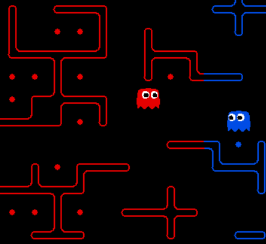

# Synchronization of Game Screens

In our multiplayer pacman game, it is important that every players' game screen are synchronized. If game screens are not synchronized, every players' game will be in different game state. Due to network latency, there will always be some delay to send message to other player when the local process can receive the message and update game state immediately.  For example, in the figure below, the first game screen will be the game screen of the player that controls the blue pacman and the second game screen will be the one for the player of red pacman. The blue pacman in the first game state can happily enter the red territory and head up to avoid the red ghost. However, in the second game state, the blue pacman cannot enter the red territory because the red ghost is blocking the entrance. The inconsistent game state between   players will make our multiplayer game meaningless.




In order to solve the synchronization problem, we modified the total ordering (TO) multicast algorithm to order the control messages for each agent. The idea is to update the state of the agents in the same frequency. No one can move another step until every other agent has taken an action. 

## Assumptions

* Processes and connections will not fail.
* Messages sent by the same process arrive in sequence.

## Algorithms

The approach we used to implement total ordering multicast is to have a sequencer to maintain the messages and ordering that should be delivered across all the processes. On initialization, every processes will maintain a process sequence number *p_seq*, 4 action queues and 4 hold-back queues. When a process want to send a control message of its agent, it B-multicast <*message_type, unique_message_id, message*> to all the processes including the sequencer. When a process receives the value, it will place the <*unique_message_id, message*> in the hold-back queue corresponds to the agent. The sequencer process will actively check the hold-back queues to see if all the agents have decided their move. If so, it will choose the latest decisions for all the agents and B-multicast one control message <*message_type, unique_message_id, group _sequence_number (g_seq)*>  for each agent to all the processes. When a process receives a message from the sequencer, it will update its game state correspondingly. The message complexity is O(2N) because when a process multicast a hold-back message, the sequencer will have to multicast a message to deliver.

The pseudocode is shown below:

```
1. For each process p
On initialization: p_seq = 0, action_q = Queue(), hold_q = Queue()

To TO-multicast message:
	B-multicast(<HOLD-BACK, msg_id, msg>)
	
On B-deliver(<HOLD-BACK, msg_id, msg>):
	hold_q.push(<msg_id, msg>)

On B-deliver(<DELIVER, msg_id, g_seq>):
	if p_seq == g_seq:
		find <msg_id, msg> in hold_q and delete the messages that arrives before msg_id
		action_q.push(msg_id)
		p_seq += 1
	else:
		hold and wait (didn't implement...)

2. For sequencer q
On initialization: q_seq = 0

If all 4 hold_q have some value:
	Select the last message in all 4 hold_q
	for msg_id in selected_messges
        B-multicast(<DELIVER, msg_id, q_seq>)
        q_seq += 1
```

## Implementations

There are 4 agents Red 1 (R1), Red 2 (R2), Blue 1 (B1), and Blue 2 (B2) in our game. For simplicity in our implementation, the process who control the B1 agent will be set as the sequencer process of our game. In order to verify a control message is sent by a normal process or the sequencer, every control message will include its message type. There are two message types in this algorithm, MESSAGE_TYPE_HOLDBACK and MESSAGE_TYPE_CONTROL_AGENT.


When a process want to send a control message (press the arrow keys on keyboard), the handleArrowControl() method in the gameRunner thread will be invoked. It will multicast <msg_type, msg_id, msg> to all other processes where the msg_type is MESSAGE_TYPE_HOLDBACK and the msg_id is consist of the role of this process (R1, R2, B1 or B2) and the msg_count. msg_count will be incremented by 1 every time the process sends a control message.

The message handler thread of each process will handle the control message that it receives. It is initialized with 4  action queues, 4 hold-back queues, and a process sequence number. When it receives a control message with MESSAGE_TYPE_HOLDBACK, it will push the <msg_id, msg> into the hold-back queue. If the msg_type is MESSAGE_TYPE_CONTROL_AGENT, it will find the corresponding message in the hold-back queue and push the control message into action queues. Then the game state of each agent will be updated according to the group sequence number and the control message. 


The sequencer process will have an extra sequencer thread that shares the 4 hold-back queues with message handler and maintain a group sequence number. It will constantly check whether all hold-back queues have at least one message. The sequencer thread will wait until it collects one message from all four hold-back queues and  multicast the selected messages with MESSAGE_TYPE_CONTROL_AGENT and a unique group sequence number to indicate the order of delivery.

## Demo

### No Synchronization

<video controls="true" allowfullscreen="true" src="video/no_ordering.mp4" type="video/mps">

### Synchronization

<video controls="true" allowfullscreen="true" src="video/ordering.mp4" type="video/mps">


## Reference

